# Agentic Teaching System

This system separates student-facing help from staff-controlled research, image generation, and publishing.

## Agents

| Agent | Student-facing | Main job |
| --- | --- | --- |
| Manager Agent | No | Assigns work, reviews outputs, approves integration. |
| Teacher And Explanation Design Agent | No | Creates multiple ways to teach the same idea. |
| Student Tutor Agent | Yes | Interviews the student about the exact stuck point and gives hint-first help. |
| Visual Learning Agent | No | Finds useful image and diagram opportunities and prepares review-only prompts. |
| Curriculum Web Audit And Misconception Research Agent | No | Checks usual syllabi, standards, practice guides, hard parts, and source-backed redesigns. |
| Truth And Fact-Check Agent | No | Grades tutor/content accuracy, reasoning, source needs, and answer-policy compliance. |
| Fun And Retention Design Agent | No | Makes lessons active, memorable, collaborative, and rewardable through mastery. |
| Content Operations Agent | No | Turns approved research/design into drafts, review gates, and publishable records. |

## Core Flow

```mermaid
flowchart TD
  A["Student writes exact confusion"] --> B["Student Tutor Agent classifies stuck point"]
  B --> C["Teacher Explanation route selected"]
  C --> D["Hint, visual prompt, metaphor, first step, example, quiz, or first principles"]
  D --> E["Student retries in own words"]
  E --> F["Student feedback: helped, still confused, too hard, needs picture"]
  F --> G["Tutor quality and redesign signal"]
  G --> H["Truth And Fact-Check Agent"]
  G --> I["Fun And Retention Agent"]
  G --> J["Visual Learning Agent"]
  H --> K["Manager review queue when needed"]
  I --> K
  J --> K
  K --> L["Content draft or visual asset can be approved"]
```

## Explanation Variation Studio

The Tool Gateway tool `explanation_variation_studio` creates:

- Confusion profile: vocabulary, visual model, first step, reasoning, misconception, or too vague.
- Seven explanation routes: diagnose, visual, metaphor, first step, real-world example, gentle quiz, first principles.
- Six visual types: annotated diagram, misconception contrast, process flow, manipulative model, real-world scene, first-principles map.
- Teacher plan: launch, direct instruction, checks for understanding, and group task.
- Tutor handoff: first question, mode order, switching rule, and answer policy.
- Web-audit handoff: staff-only research questions and approved source targets.

Parents and staff can run this planning tool. Students cannot run it directly.

## Web Audit Rules

The Curriculum Web Audit And Misconception Research Agent should use staff-controlled tools only. It should never expose unrestricted web search to students.

The live fetch path is `live_curriculum_source_audit`. It runs on the server through the Tool Gateway and can fetch only approved HTTPS source targets from the curriculum/practice-guide allowlist. The output is stored as source-ledger evidence and a redesign task for human review.

The web audit must record:

- Research question.
- Source checked.
- Checked date.
- Claim.
- Trouble signal.
- Redesign move.
- Reviewer status.

The output becomes source-ledger rows and redesign tasks. It does not become student-facing until content review, truth review, visual approval, accessibility review, and manager approval pass.

## Visual Rules

Visuals are separate from explanations. An explanation route may request a visual, but the Visual Learning Agent must still create a reviewed visual plan.

Required visual types:

- Annotated diagram for seeing a relationship.
- Misconception contrast for comparing wrong and correct thinking.
- Process flow for first-step confusion.
- Manipulative model for concrete reasoning.
- Real-world scene for transfer.
- First-principles map for rebuilding the idea from basics.

Generated images remain review-only until approved.

## Safety Boundary

Students can ask the tutor for help, but they cannot:

- Trigger web browsing.
- Generate images.
- Publish content.
- Run staff tools.
- Receive direct final quiz or homework answers.

Staff and parent tools can inspect, plan, and review. Only approved content and visuals become part of the student lesson experience.

## Account Boundary

The prototype now supports local signed-session accounts for parent, teacher, and student roles. These accounts let the server test real role claims while the product is still local.

Production still needs an external identity provider, verified parent ownership, child account management, row-level database enforcement, password recovery, export, and deletion workflows.
